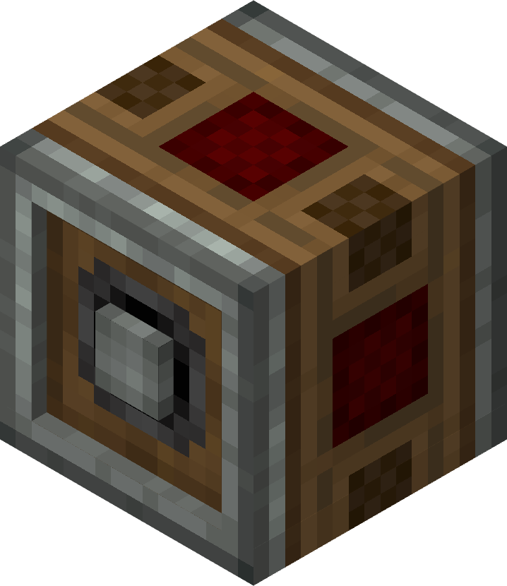

# Adjustable Chain Gearshift

The Adjustable Chain Gearshift functions similarly to Encased Chain Drive, but can change the speed of the output when powered with redstone.

## Usage

To control the speed of an encased chain, the Adjustable Chain Gearshift must be placed in line with Encased Chain Drives with sides touching. To increase the speed of an encased chain, an Adjustable Chain Gearshift must be connected to the source of rotational power by its axis and it must be powered by a redstone signal. A full strength redstone signal will double the speed of the chain. A partial strength signal, such as given by an analog lever, will give a proportional increase in speed between 1x and 2x.

If a redstone-powered Adjustable Chain Gearshift receives its rotational power from an encased chain, then it will reduce the rotation speed of its axis by up to half, again depending on the strength of the redstone signal.

Using an analog lever, the following gear ratios can be obtained:
