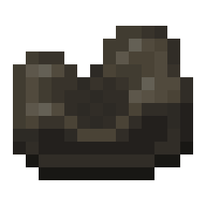

# Mechanical Belts

A Mechanical Belt is a mechanical component that conveys rotation and moves items and entities.

## Usage

### Placement

Placing a Belt requires at least two Shafts. Place the Belt by right-clicking on the first shaft and then right clicking the second. Regardless of the length, this only consumes one mechanical belt. Both shafts must face the same direction.

A Mechanical Belt can be placed over any number of Shafts arranged horizontally, vertically, or diagonally (45° towards the y axis) in a single line, provided that no obstructions are present and that the total length is no longer than twenty blocks (adjustable in the Config). The Mechanical Belt also require that the two shafts face the same direction. Andesite Casing and Brass Casing can be placed over any segment of a Belt.

Once a Belt is placed, it can be extended by right clicking the end with a Mechanical Belt in hand while the belt is `under 20 blocks`, though this does not consume the belt. Belts can also be shortened by right clicking them with a Wrench. Both actions relocate the Shaft.

### Moving Entities and Items

The Mechanical Belt can transport items from one location to another. Items can either be thrown onto the belt, and machines such as Funnels, Chutes or Mechanical Arms can place items onto the belt or remove items from the belt. A belt can also transport entities and the player. Diving Boots can be worn to negate this effect. You can also negate it while crouching. Items cannot be moved by vertical belts. The belt moves items at ${\displaystyle ({\frac {75}{32}}\times k\times a)}$ items/min, where ${\displaystyle k}$ is the belt speed (RPM) and ${\displaystyle a}$ is the stack size on the belt. Thus the belt's speed changes at a rate of `2.35 items/min` for every additional RPM. For instance, a belt moving at `64 RPM` will move `150 items per minute` when the belt contains singular items.

If you need to transport more than `600 items per minute`, you will need to use a Brass Funnel to place stacks of items on the belt. At `64 RPM`, this results in a throughput of `9600 items/min`.

### Common Speeds

| RPM | Processing Time (sec/item) | Throughput (items/sec) |
| --- | -------------------------- | ---------------------- |
| 4   | 9.375                      | 600                    |
| 8   | 18.75                      | 1,200                  |
| 16  | 37.5                       | 2,400                  |
| 32  | 75                         | 4,800                  |
| 64  | 150                        | 9,600                  |
| 128 | 300                        | 19,200                 |
| 256 | 600                        | 38,400                 |

### Relaying Rotational Power

When rotational force is connected to any shaft of a belt, the belt conveys identical force to every other shaft it is connected to. As such, if two shafts are connected to external sources of rotational force, a belt cannot be placed connecting them unless the force is in the same direction and at the same speed.

### Interactions

Components that are commonly used in conjunction with the Mechanical Belt include:

- Mechanical Press
- Deployer
- Spout
- Brass Tunnel
- Funnel
- Chute
- Depot
- Mechanical Arm
- Encased Fan

A Mechanical Press presses items on the belt that pass underneath it. Deployers can use their held item on the items that are on the belt which is useful for making train tracks and precision mechanisms. Spouts also fills valid items with the corresponding liquid that it has been supplied with. Brass Tunnels may be used to separate items from stacks or reorganize them as they move along the belt and through the Brass Tunnels. Chutes and Funnels can place items from machine inventories onto the belt or take items off the belt when facing the belt. A belt can place items onto a Depot which allows other machines such as a Chute or a Mechanical Arm to pick up the item and transfer them somewhere else. Encased Fans can modify the item on the belt as it travels along it such as bulk washing or bulk smelting.

### Dyeing

Mechanical Belts can be dyed be right clicking on them with a Dye. This will add colored stripes along the edges of the belt. To remove the dye, right click on the belt with a Water Bucket or Water Bottle.
