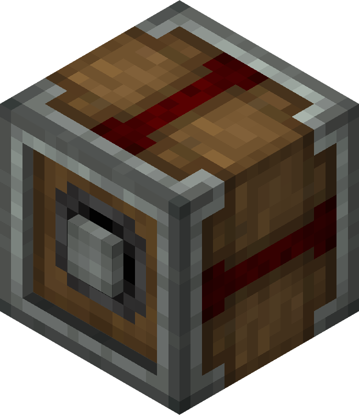

# Clutch

The Clutch stops outgoing rotation when a redstone signal is applied.
When the Clutch is not activated by a redstone signal, it will transfer rotation like a Shaft. When it is supplied with a redstone signal, it will stop transferring rotation.

