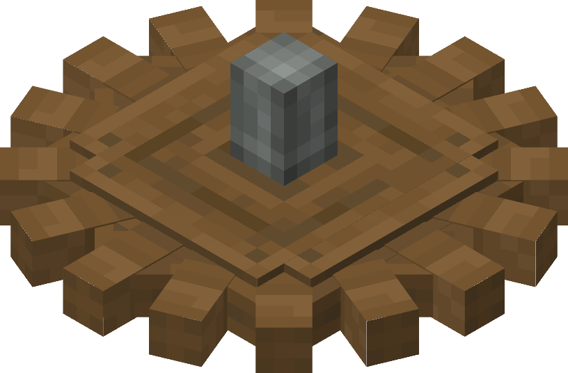

# Cogwheels

The Cogwheel is a basic mechanical component in Create that relays rotation in a straight line and to adjacent cogwheels.

The Large Cogwheel is a larger variant of the cogwheel that can relay rotation around corners, allow for change in Rotation Speed when connected to its smaller Counterpart, and power Rotation Speed Controllers.

## Usage

### Conveying Rotation

Cogwheels have three main methods of interlocking:

- Two Cogwheels interlock when placed next to each other (not diagonally) and facing the same direction. When rotational force is provided to one of the cogwheels, the force will be provided to the other Cogwheel at the same speed but in the opposite direction.
- Two Large Cogwheels interlock when placed perpendicular to each other, effectively changing its axis and direction, but not its speed.
- A Cogwheel and a Large Cogwheel interlock when placed diagonally to each other and facing the same direction. The Large Cogwheel will rotate at half the speed of the Cogwheel.

A cogwheel can also be used like a Shaft, conveying rotation from the ends of its axis. They can be stopped from doing this by applying a Casing, configurable with a Wrench. Mechanical components can be connected to each end, and several Cogwheels connected end-to-end function the same as multiple shafts would.

### Adjusting Speed (Gear Ratios)

Using pairs of Cogwheels and Large Cogwheels, rotational speed can be easily doubled or halved using the mechanic mentioned above. It is possible to connect many pairs of Large Cogwheels and Cogwheels to apply this mechanic repeatedly, up to 256 RPM (Though that limit can be increased or decreased in the Config).

A Large Cogwheel can also be connected to a Rotation Speed Controller, to adjust speed more precisely.

### Activating Components

Some blocks need to be powered by a Cogwheel to function. Those blocks contain a Cogwheel in their texture and can be powered by placing a Cogwheel adjacent to them or a large Cogwheel diagonally, both in the same direction as the block, like a normal Cogwheel.
