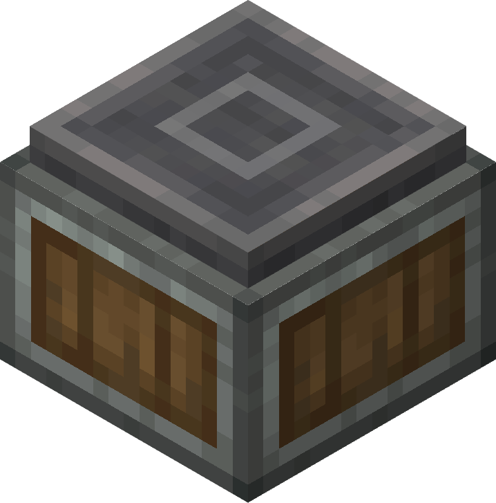
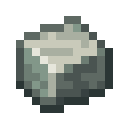

# Depot

The Depot is used as an interaction point for machines such as Mechanical Arms, Mechanical Presses, Spouts, etc.

## Crafting

---

|  |  |  |
| ---------------------------------------------------------- | ---------------------------------------------------------------------------------- | ------------------------ |
|                                    |                                                            |  |
|                                    |                                                            |  |

## Usage

---

### Holding Items

Items can be right clicked or inserted onto the depot. Machines such as Mechanical Presses will interact with the items the same way they would on a Mechanical Belt.

Items on a depot will not despawn, and will stay there until they are extracted by a player or another machine.

### Display Link

Depots can be sources for Display Links. As well as displaying the name of the item in the depot, items held by other depots placed in a row behind the main depot will be displayed.
