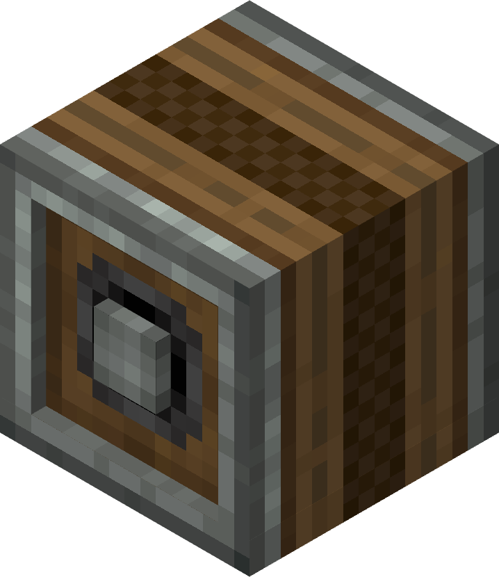

# Encased Chain Drive

The Encased Chain Drive is a block that can transfer rotation much like the Mechanical Belt.

## Usage

Encased chain drives may be placed side by side either vertically or horizontally to form a chain passing rotational power among all the blocks. The blocks must touch on their sides (not axis to side) and be in a single straight line to form a chain. The axes of the encased chain drives may be all parallel or blocks can be rotated to orient the axis perpendicularly. Encased chain drives can also pass rotational power through their rotating axis, but this is not a continuation of the same chain.

### Orientation Constraints

The image to the right illustrates several options and constraints for connecting encased chain drives. Panel A shows a typical arrangement with a single string of drives with their sides touching. This forms a straight brown line in the graphics representing the axis of the encased chain. Panel B shows that even though two added blocks are touching sides with a string of drives, they are not forming a single line and so do not receive power. Panel C shows bocks having been attached with axes touching sides. Axes cannot pass or receive power from the side of an encased chain block. Panel D shows that new alignments can be created using rotated encased chain blocks to couple separate chains.

### Changing Rotation Speed

Encased Chain Drives can also be connected to Adjustable Chain Gearshifts, which can change the speed based on the redstone power input.
