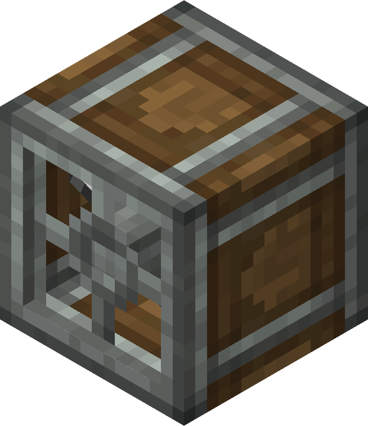

# Encased Fan

The Encased Fan is a mechanical component that can create air streams. Encased Fans are used for moving entities, vertical transport of items, Bulk Washing, Bulk Blasting, Bulk Haunting, and Bulk Smoking.

The Encased Fan connects to other rotational components from the back.

## Usage

### Breakdown of Fan-based Processing

Bulk Blasting can process items like a Furnace. This requires a heated blaze burner or Lava. This is similar to a Furnace.

Bulk Smoking can process items like a Smoker. This requires an unheated Blaze Burner, fire, or a Campfire. This is similar to a Smoker.

Bulk Washing requires water to be placed directly in front of the fan’s airstream. Additional Information: This can be done on a Belt or a Depot.

### Pushing/Pulling Entities

When powered by Rotational Force, an Encased Fan creates an air stream that extends several blocks in front of it. This air stream pushes entities away from the fan or pulls entities towards it depending on the direction of the rotation that the fan receives. Powering an Encased Fan with faster rotational force will cause its air stream to be stronger and faster.

Items will always be pushed, but mobs or players won't be pushed until the Fan is running at least 4 rpm. The maximum push and pull distance can be changed in the Config. Below is a table detailing how far a fan can push items horizontally.

### Entity Push and Bulk Processing distance

| Speed (RPM) | Distance (Blocks) |
| ----------- | ----------------- |
| 1-12 RPM    | 4 blocks          |
| 16-28 RPM   | 5 blocks          |
| 32 RPM      | 6 blocks          |
| 48 RPM      | 7 blocks          |
| 64 RPM      | 8 blocks          |
| 80 RPM      | 9 blocks          |
| 96 RPM      | 10 blocks         |
| 112 RPM     | 11 blocks         |
| 128 RPM     | 12 blocks         |
| 192 RPM     | 16 blocks         |
| 256 RPM     | 20 blocks         |

### Vertical Item Transport

Fans can also be used to push or pull items through Chutes. Items inserted into the chutes will be pushed/pulled by the fan.

### Bulk Item Processing

When the air stream of an Encased Fan passes through certain blocks, the air stream downstream will apply the respective processing to items.

Washing

- Water

Smoking

- Fire
- Campfire
- Empty Blaze Burner lit with Flint and Steel
- Blaze Burner (smoldering)

Blasting

- Lava
- Fueled Blaze Burner

Haunting

- Soul Fire
- Soul Campfire
- Empty Blaze Burner lit with Flint and Steel **and right clicked with Soul Sand or Soul Soil.**

The respective recipes are applied to item entities when they sit in the air stream, whether they are in the world, on a Mechanical Belt, or on a Depot. These recipes can be applied to multiple items at once.

The Fan's airstream can pass through certain blocks, such as non-solid ones and those tagged with FAN_TRANSPARENT. 4 ray tests are also performed to check for holes in the block's collision shape. These blocks may be useful for building bulk item processing setups, as they can hold back lava or water while allowing the air stream through. The following is a list of blocks with the FAN_TRANSPARENT Tag:

- Fences
- Iron Bars
- Metal Bars
- Campfires
- Leaves
- Sail Frames
- Copycat Blocks

The following blocks do not have the FAN_TRANSPARENT tag, but are transparent:

- Sign

### Mob Interaction

When the player or a mob steps into a Bulk Processing stream, various effects may be applied.

- Smoking sets the entity on fire and deals 2 damage (1 ♥) or 3 damage (1.5 ♥) depending on Difficulty.
- Blasting sets the entity on fire and deals 3 damage (1.5 ♥), 4 damage (2 ♥), or 6 damage (3 ♥) depending on Difficulty.
- Washing streams extinguish entities on fire and deal 2 damage (1 ♥) to Endermen, Blazes, and Snow Golems.
- Haunting streams apply Slowness II and Blindness.

### Bulk Item Processing Speed

All forms of Bulk Processing (Smoking, Blasting, Haunting, and Washing) process items at the same speeds. Multiple fans applying the same processing effect on the same block divide the processing time. For example, two fans creating an air stream through water will process the same amount of items twice as fast as one fan. However, different stack sizes take a different amount of time to process, as listed below:

| Item count/stack | Processing Time | Max Belt Speed |
| ---------------- | --------------- | -------------- |
| 1-16             | 7.5 seconds     | 3.2 RPM        |
| 17-32            | 15 seconds      | 1.6 RPM        |
| 33-48            | 22.5 seconds    | 1.06 RPM       |
| 49-64            | 30 seconds      | 0.8 RPM        |

Note that if a recipe's output is also a valid input for a different recipe (such as Cobblestone → Stone → Smooth Stone), the second recipe will start being processed immediately after the previous one is finished. Use Depots with filtered Brass Funnels, Mechanical Arms with filtered outputs, or Mechanical Belts set to the correct speed.
