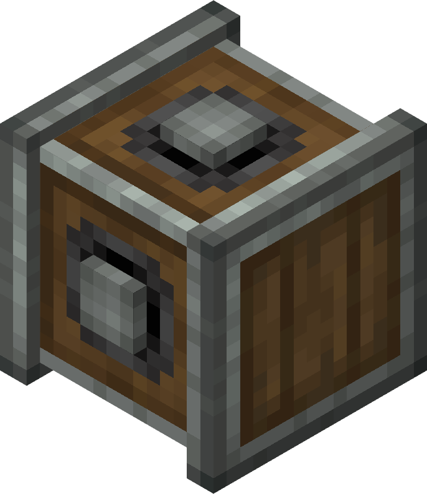

# Gearboxes

The Gearbox is a block used to transfer Rotational power in 4 directions, either horizontally or vertically.

## Usage

The Gearbox can relay rotational power in four horizontal directions. The vertical counterpart, like the normal version, can relay power in four vertical directions.

When receiving input from any input side (sides with a shaft shape), the Gearbox will output/relay rotational power in opposite spin for all of the remaining sides. In another word, when the input is clockwise, the output on the other 3 sides will be anti-clockwise, and vice-versa.
