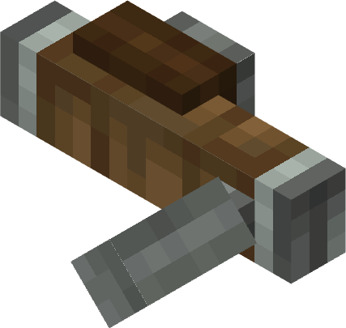

# Hand Crank

The Hand Crank generates a small amount of Rotational Force through player interaction.

## Usage

Hold right click to rotate the Crank counter-clockwise and shift right click to reverse the rotation.

The Hand Crank will rotate at `32 RPM` for around 0.5 seconds. One usage of the Hand Crank will rotate a Mechanical Bearing connected 1:1 90°.

Use of the Hand Crank will deplete hunger.
