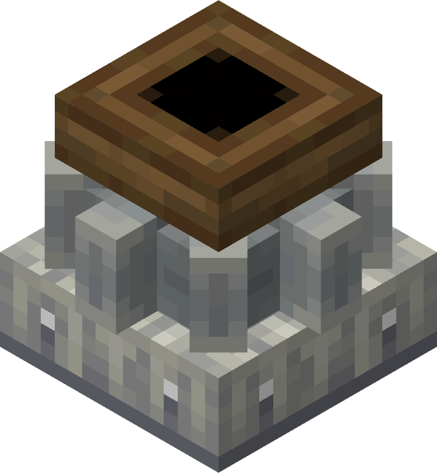

# Millstone

The Millstone is a more basic equivalent of the Crushing Wheels, and is most likely the first of the two that the Player will construct. It is capable of applying milling recipes to any valid items inserted from above.

## Usage
