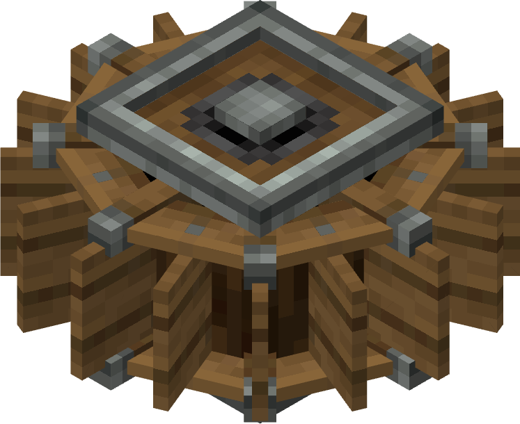

# Waterwheels

The Water Wheel is a source of rotational power. It generates Rotational Force when water flows over it.

Due to the fact that the materials required to craft it are easily accessible, the Water Wheel serves as the simplest automatic generator and can be made very early in the game.

Stress Capacity = 16SU per RPM

Total stress capacity can be increased by adding more wheels in parallel.

## Usage

When water flows over a Water Wheel, it will begin to rotate. This rotational power can be conveyed to other Components from the Water Wheels' Shaft.

As long as the water flows around the wheel in mostly one direction, the Wheel will generate Rotational Force.

## Appearance

The Water Wheel's appearance can be changed by right-clicking any type of Planks on it. The items will not be consumed. Each texture is automatically generated using the planks and logs of a wood type, allowing for some compatibility with other mods.
