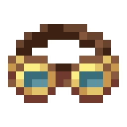

# Engineer's Goggles

Engineer's Goggles are a wearable item that allow the user to see more details about Create machines and contraptions.

## Usage

While worn in the helmet slot, the Engineer's Goggles will show the stress impact of the viewed machine while it is running. They will also give numbers and highlight the current rotation when looking at a Stressometer or Speedometer. Additionally, they show how much fluid is in a tank along with the total storage capacity of the tank.

### Detecting Speed

Upon attaching any rotating component to a network while wearing the Engineer's Goggles, a particle effect will briefly appear rotating around the component, demonstrating the direction of rotation through it's motion and demonstrating the speed of rotation through it's color.

This particle effect only appears when placing a component, and cannot be used to analyze existing components.

### Reading Gauges

Looking at a Speedometer while wearing the Engineer's Goggles will display the exact speed of the system in Rotations Per Minute (RPM), as well as the color coded speed of the system.

Stressometers can be read the same way, but will instead display the percentage of stress capacity being utilized by the system, the remaining base stress capacity of the system, and the remaining stress capacity of the system at the current RPM.

### Speed Color Code

🟩 Green represents slow rotation less than `30 RPM`.

🟦 Blue represents moderate rotation greater than or equal to `30 RPM - 99 RPM`.

🟪 Purple represents fast rotation greater than or equal to `100 RPM`.

### Generator Stats

Looking at a kinetic component which produces rotational force will display the base stress capacity produced by that generator and the stress capacity produced by that generator at the current RPM.

### Kinetic Stats

Looking at a kinetic component which consumes rotational force will display the base stress impact of that component and the stress impact of that component at the current RPM.

