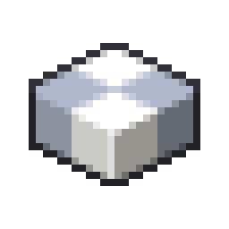

# Pondering

Pondering is an in-game guide system that allows the player to quickly get information about Create blocks. The pondering screen shows an example contraption that explains the functions of the block.

## Usage

The full Ponder Index can be accessed through the Create menu by clicking the Engineer's Goggles icon in the pause menu.

An item can be Pondered by hovering over it in your inventory and holding forward ("W" by default) until the bar below the item is filled up. This displays an animated infographic about the item being pondered.

## Keybinds

The keybinds for ponder are the same as those for certain player actions.

| Keybind        | Action                                                                                                                                                                     |
| -------------- | -------------------------------------------------------------------------------------------------------------------------------------------------------------------------- |
| **Q**          | Activate **Identify Mode**. This pauses the current ponder scene. Hovering over Create elements shows the name of the block and gives the option to ponder those elements. |
| **S**          | Restart the current animation.                                                                                                                                             |
| **A** or **D** | Go backwards or forwards a scene (if available).                                                                                                                           |
| **E**          | Close the animation.                                                                                                                                                       |

Comfy Reading does not currently have a keybind, but can be enabled by tapping the button in the bottom right. This slows down the entire animation to help read the text boxes.

## Navigation

While Pondering, similar or relevant machines can be viewed by clicking the icon to the left or activating identify mode and holding W over a visible component. After moving away from the initially pondered item, the option to "Think Back" can be found at the bottom left. The player can skip to specific parts of an animation by clicking different sections of the gray bar at the bottom.

## Categories

Ponder scenes are sorted into different categories based on the pondered blocks usage and function. The different categories are:

| Category                 | Description                                                                                                       |
| ------------------------ | ----------------------------------------------------------------------------------------------------------------- |
| Kinetic Blocks           | Components which help relaying Rotational Force elsewhere                                                         |
| Kinetic Sources          | Components which generate Rotational Force                                                                        |
| Kinetic Appliances       | Components which make use of Rotational Force                                                                     |
| Fluid Manipulators       | Components which help relaying and making use of Fluids                                                           |
| Item Transportation      | Components which help moving items around                                                                         |
| Logic Components         | Components which help with Redstone Engineering                                                                   |
| Creative Mode            | Components not usually available in Survival Mode                                                                 |
| Movement Anchors         | Components which allow the creation of moving Contraptions, animating an attached structure in a variety of ways. |
| Contraption Actors       | Components which expose special behavior when attached to a Contraption.                                          |
| Block Attachment Utility | Tools and Components used to assemble structures moved as an animated Contraption.                                |
| Railway Equipment        | Components used in the construction or management of Train contraptions                                           |
| Recent Changes           | Components that have been added or changed significantly in recent versions of create                             |

Mod authors and pack developers can add their own Ponder categories for their own purposes as well.
